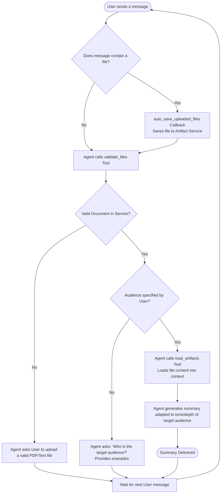

# 📄 TLDR - PDF & Document Summarisation Agent

An intelligent, interactive document summarisation agent built with **Google ADK (Agent Development Kit)** and powered by **Gemini Flash**. 

TLDR doesn't just generate generic summaries; it validates your files and adapts its language, tone, and depth to match your target audience (e.g., business executives, primary school children, or software engineers).

---

## ✨ Features

- **File Validation:** Automatically scans and validates uploaded PDFs and text documents. Rejects images and unsupported file formats.
- **Audience-Tailored Summaries:** Interactively asks for the target audience before generating the summary, then adapts the vocabulary and complexity accordingly.
- **Local Interactive Playground:** Includes a sleek, web-based UI chat playground for local development and testing.
- **Production-Ready:** Ready for deployment to Google Cloud Run with Terraform infrastructure and telemetry (Cloud Trace, Cloud Logging).
---

## 🔄 Process Flow

Below is the execution flow and logic of the TLDR agent:



---


## 🛠️ Project Structure

```
tldr/
├── app/                      # Core agent code
│   ├── agent.py              # Main agent logic (validation, audience selection, summarisation)
│   ├── fast_api_app.py       # FastAPI application wrapper for the agent
│   └── app_utils/            # Telemetry, typing, and system helpers
├── tests/                    # Unit and integration tests
├── pyproject.toml            # Project dependency definitions (uv-managed)
└── README.md                 # Setup and usage guide
```

---

## 🚀 Setup & Installation

### 1. Prerequisites

Make sure you have the following installed on your local machine:

1. **Python 3.11+**
2. **uv** (Ultra-fast Python package manager)
   - Follow the [uv installation guide](https://docs.astral.sh/uv/getting-started/installation/) or run:
     ```bash
     # macOS/Linux
     curl -LsSf https://astral.sh/uv/install.sh | sh
     # Windows (PowerShell)
     irm https://astral.sh/uv/install.ps1 | iex
     ```
3. (Optional, for those who want to deploy to Google Cloud) **Google Cloud SDK (gcloud)**
   - Follow the [Google Cloud SDK installation guide](https://cloud.google.com/sdk/docs/install).

---

### 2. Install CLI Tools & Dependencies

Clone this repository, navigate to the directory, and run the following commands:

```bash
# 1. Install google-agents-cli globally
uv tool install google-agents-cli

# 2. Setup the CLI tool skills
uvx google-agents-cli setup

# 3. Install project dependencies locally
agents-cli install
```

---

### 3. Authentication & Configuration

The agent uses **Gemini Flash** and requires Google Cloud authentication or an API key. You can authenticate in one of two ways:

#### Option A: Using a `.env` file (Simplest)
In the `app/` directory, open `.env` and paste your Gemini API key:
   ```env
   GOOGLE_API_KEY=your_actual_api_key_here
   ```

#### Option B: Using Google Cloud SDK (For GCP users)
Run the following command to authenticate your local environment:
```bash
gcloud auth application-default login
```
*Note: Make sure your active Google Cloud project has the Gemini API / Vertex AI API enabled.*

---

## 💻 Running the Agent Locally

Start the local interactive playground (a web interface where you can chat with the agent and upload files):

```bash
agents-cli playground
```

Once started, open the playground URL (usually `http://localhost:8000/playground`) in your web browser.

### How to use TLDR:
1. **Upload a file:** Click the paperclip icon and upload a PDF or text document.
2. **Audience Prompt:** The agent will validate the file and ask you to select or describe a target audience (e.g., "primary school children", "business executives").
3. **Summary Generation:** Type your audience, and TLDR will immediately read the document and generate a summary tailored specifically to them.

---

## 🧪 Testing & Validation

Run unit and integration tests using pytest:

```bash
uv run pytest tests/unit tests/integration
```

---

## 🚢 Deployment

To deploy this agent to Google Cloud:

1. **Set your Google Cloud project:**
   ```bash
   gcloud config set project <your-project-id>
   ```
2. **Deploy the agent:**
   ```bash
   agents-cli deploy
   ```

To set up infrastructure pipelines (Terraform) or continuous integration:
```bash
agents-cli scaffold enhance
```

---

## 📚 Development & Commands Reference

| Command | Purpose |
|---------|---------|
| `agents-cli playground` | Launch the local development UI playground |
| `agents-cli install` | Install/sync Python dependencies |
| `agents-cli lint` | Run code quality and formatting checks |
| `agents-cli eval generate` | Run the agent against the evaluation dataset |
| `agents-cli eval grade` | Grade the evaluation traces |
| `uv run pytest` | Run tests |
